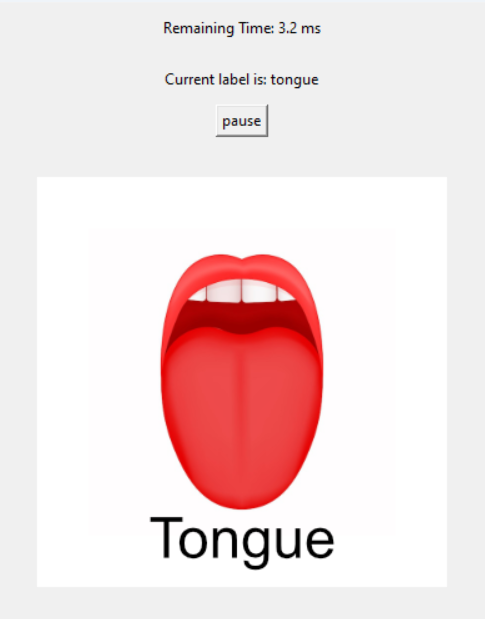
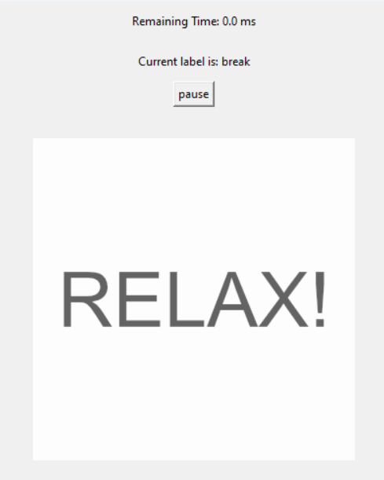
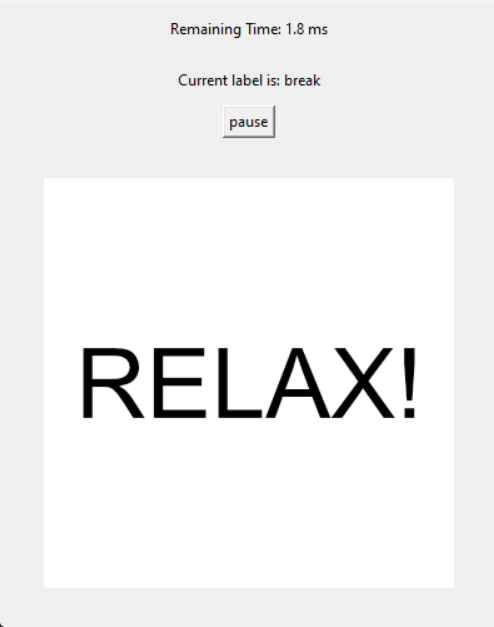
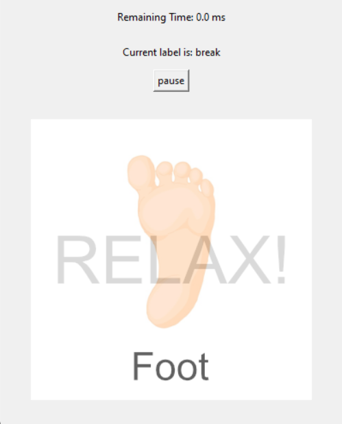
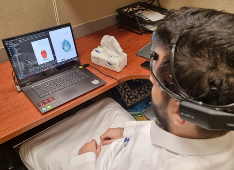

# EEG dataset collection using Emotive API
## Description
This repositry is part of our graduation project which aimed to control a robot using EEG signals in other words "control a robot with brain" more details [here](https://drive.google.com/uc?id=1rbv_2un8wdHVA2X0vwBJDXAJMr_80B7C).

This repo is the python tool we devoloped to record our dataset with easy-to-use interface.

Team members: [Abdelrahman Fatouh](https://github.com/abdo20050), [Abdullah Almingash](https://www.linkedin.com/in/abdullah-almingash-18080a302?utm_source=share&utm_campaign=share_via&utm_content=profile&utm_medium=ios_app), and Saad Aldobaian

Advisor: [Prof. Ghulam Muhammad](https://faculty.ksu.edu.sa/en/ghulam)

---

<sub><span style="color: #888;">The completion of this project occurred within the Computer Engineering Department at the College of Computer and Information Sciences, <a href="https://ksu.edu.sa/en/" target="_blank"><b>King Saud University</b></a>.</span ></sub>


## Limitation
EEG signals is hard to collect and since each brain is different we were limited to some criterias.
- The classes should be in random order so the subject won't predict the next class
- The classes are showen in equal amout so our dataset is balanced
- The subject should be able to pause the process so they won't be exhasted causing low quality data
- There are breaks between the records where subject
- Subject should know what the next class to record during break time
## Requirements
- Emotive headset
- SDK license to support EEG data collection

## How to install 
1. Go to your desired directory from terminal
   ```bash
   cd ./EEG_dataset_collection
   ```
2. Then clone the repo
   ```bash
   git clone 
   ```
3. Then install the requirements
   ```bash
   pip install -r requirements.txt
   ```

## Before you start

To run the existing example you will need to do a few things.

1. You will need an EMOTIV headset.  You can purchase a headset in our [online
   store](https://www.emotiv.com/)
2. Next, [download and install](https://www.emotiv.com/developer/) the Cortex
   service.  Please note that currently, the Cortex service is only available
   for Windows and macOS.
3. We have updated our Terms of Use, Privacy Policy and EULA to comply with
   GDPR. Please login via the EMOTIV Launcher to read and accept our latest policies
   in order to proceed using the following examples.
4. Next, to get a client id and a client secret, you must connect to your
   Emotiv account on
   [emotiv.com](https://www.emotiv.com/my-account/cortex-apps/) and create a
   Cortex app. If you don't have a EmotivID, you can [register
   here](https://id.emotivcloud.com/eoidc/account/registration/).
5. Then, if you have not already, you will need to login with your Emotiv id in
   the EMOTIV Launcher.
6. Finally, the first time you run these examples, you also need to authorize
   them in the EMOTIV Launcher.

This code is purely an example of how to work with Cortex.  We strongly
recommend adjusting the code to your purposes.

## Cortex Library
- [`cortex.py`](./cortex.py) - the wrapper lib around EMOTIV Cortex API.

## Create record and export to file
- [`record_dataset.py`](./record_dataset.py) shows how to create record and export data to CSV or EDF format.
- For more details https://emotiv.gitbook.io/cortex-api/records

## Create random balanced labels
- [`label_generator.py`](./label_generate.py) an object used to generat the next label in random order with balanced amount of recurances for each label

## Interactive and easy UI
- [`TK_window.py`](./TK_window.py) is the code responsible for showing the interactive window and interacte with the subject.

## Screenshots
<table>
  <tr>
    <td></td>
    <td></td>
  </tr>
  <tr>
    <td></td>
    <td></td>
  </tr>
</table>

## Live images of the process


